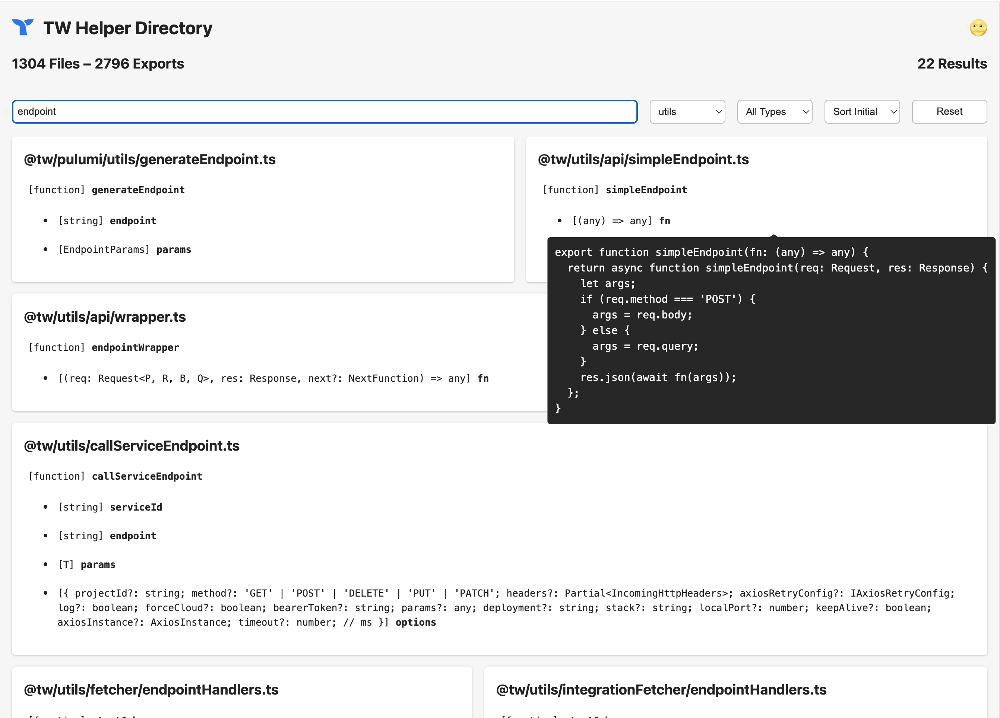
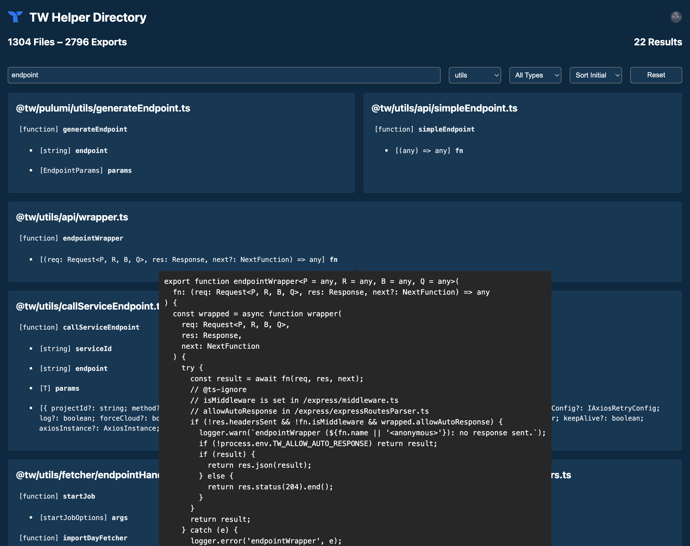

#  Listings Headless

> List all exports from all JS/TS files in a directory.

Current directory is a snapshot of `@tw` utilities.

Using Vite and Static Data vs Express server.

## Quick Start

```bash
yarn && yarn start
```

## Generate Static Data

```bash
yarn generate
```

## Screenshots

|         Light        |          Dark         |
| -------------------- | --------------------- |
|  |  |
